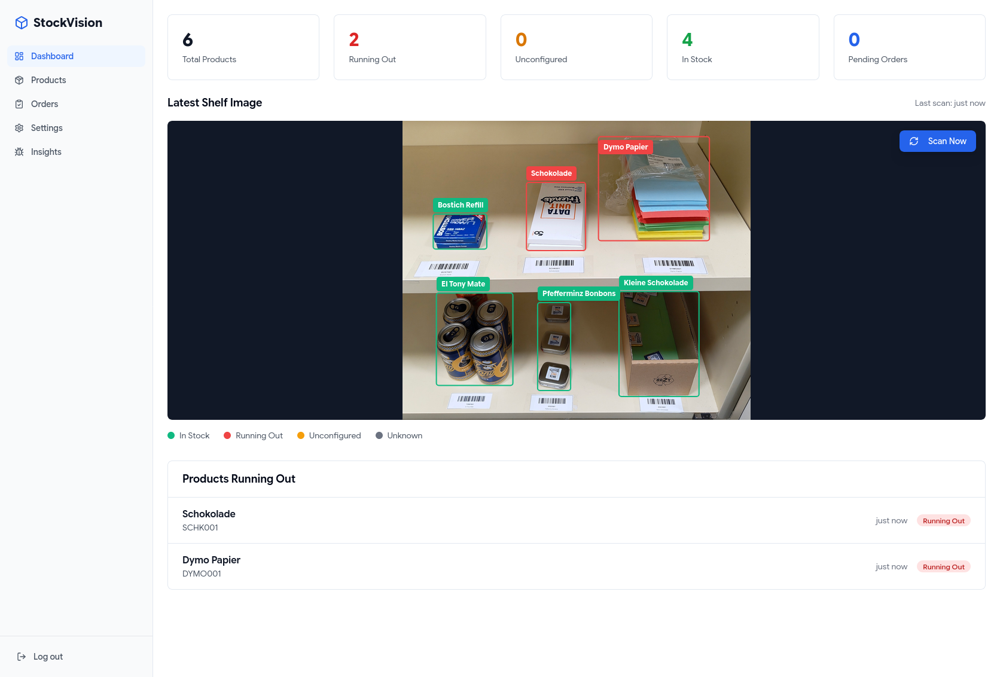
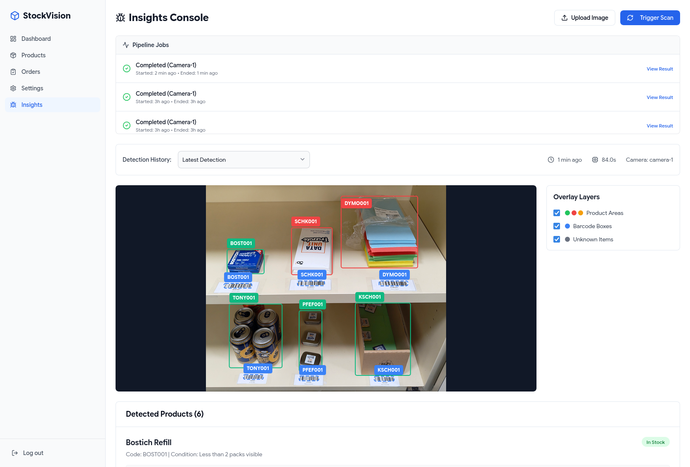
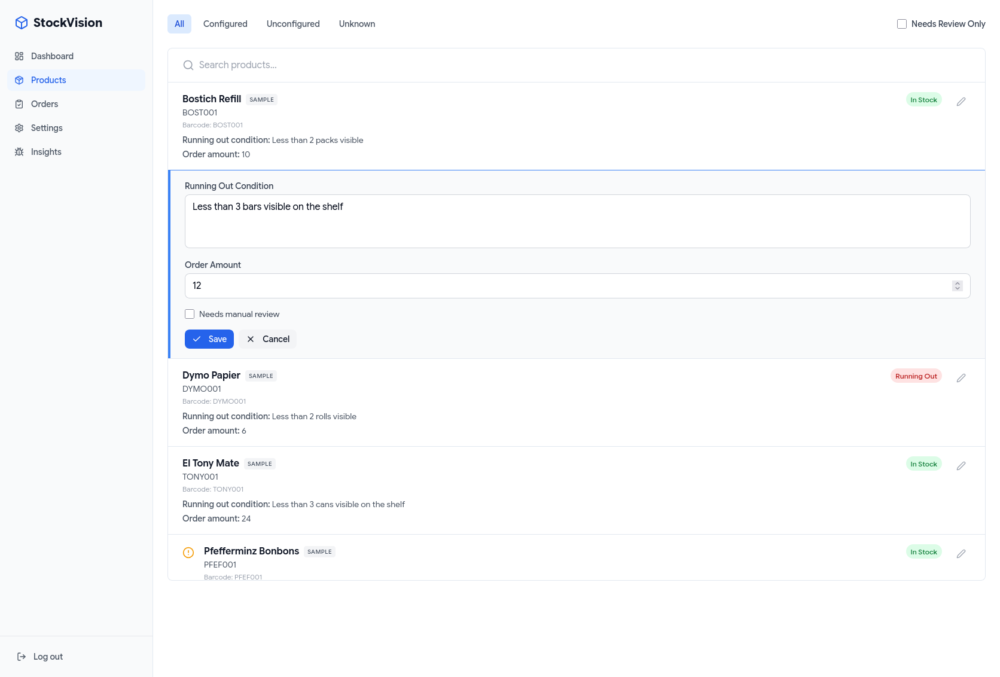
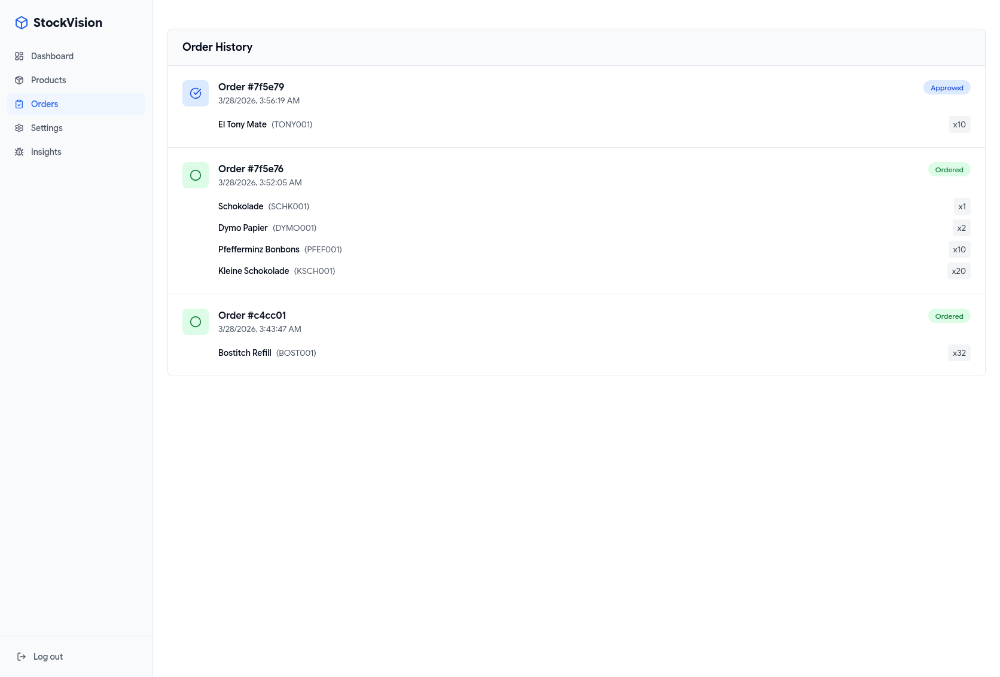
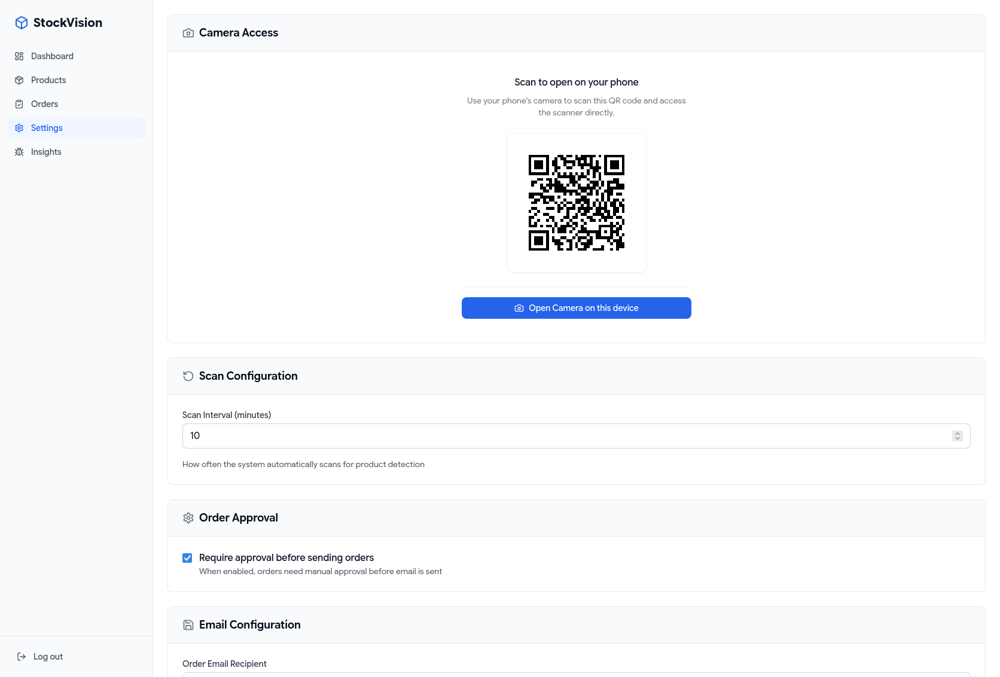
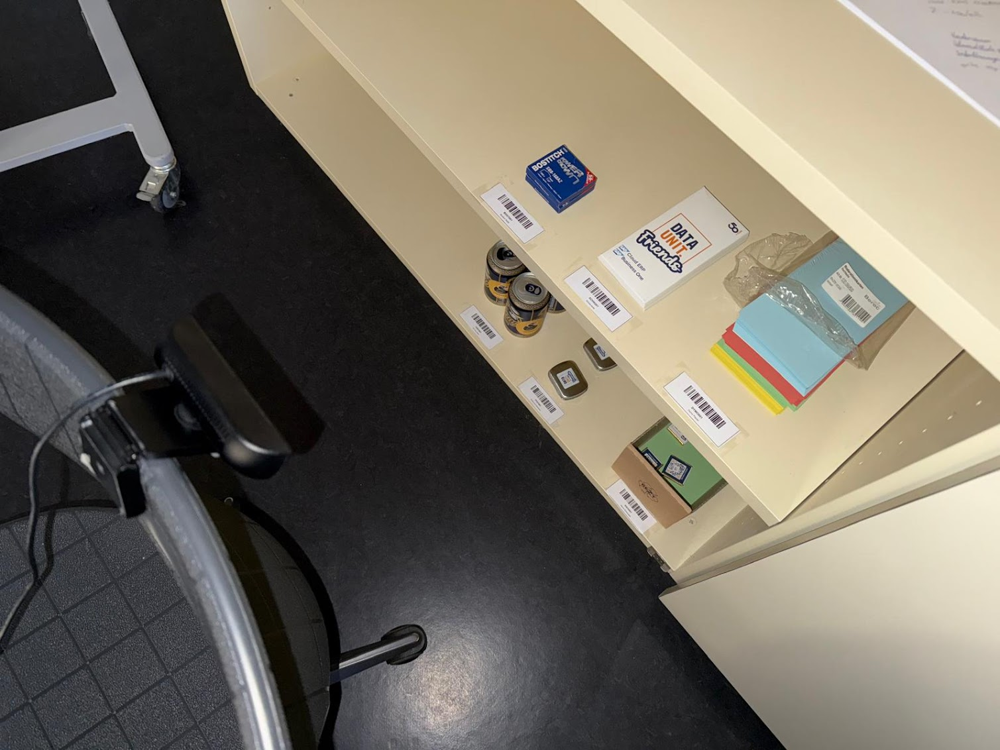
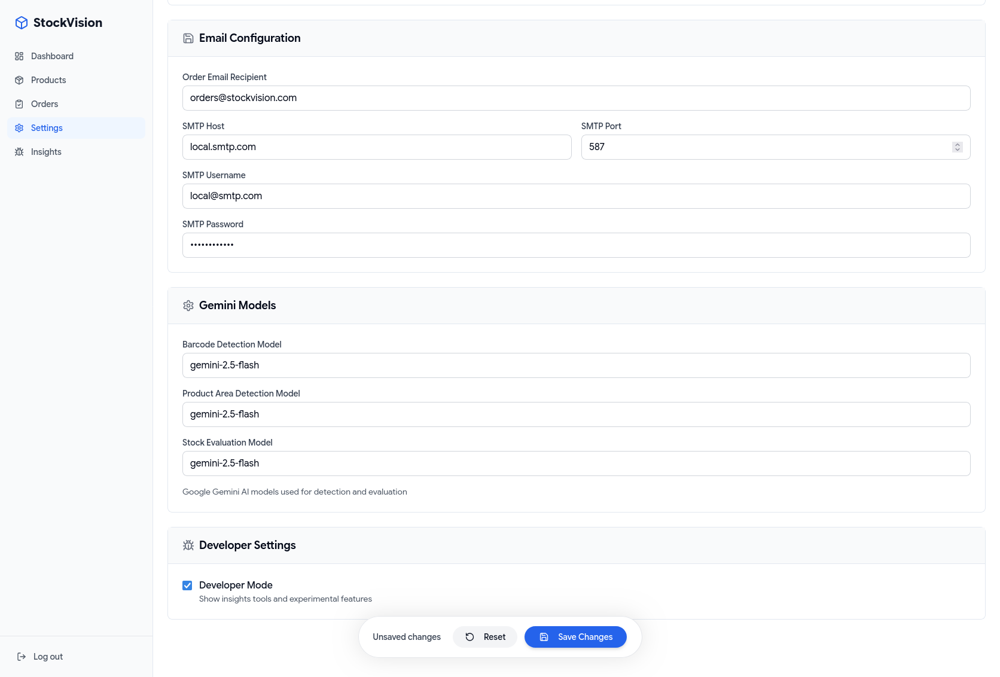
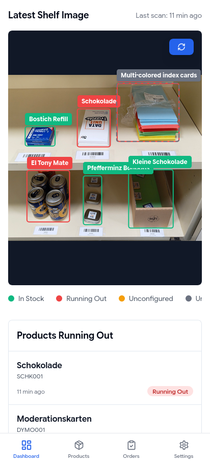
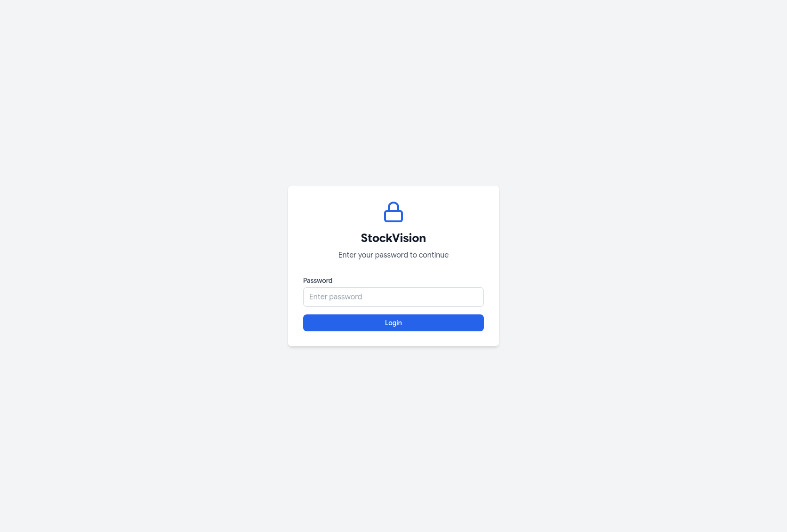

# StockVision Showcase

Welcome to **StockVision** — a stationary automated stock-taking system for small warehouses.

StockVision utilizes cameras pointed at shelves to capture images, sending them through an AI pipeline powered by Google Gemini. It detects products via barcodes, evaluates stock levels using natural-language conditions, and automatically triggers reorder workflows.

Here is a comprehensive overview of the application's capabilities, features, and user interfaces.

---

## Dashboard & Live Monitoring

The dashboard is the central hub for monitoring warehouse health in real time.

- **KPI Cards**: Instantly view total products, items running out, unconfigured items, healthy stock, and pending orders.
- **Live Image Widget**: A prominent viewer showing the latest camera detection image alongside a summary of detected products.
- **Stock Health Board**: A "Products Running Out" panel highlights critical items with their last detected timestamps and colored status chips (e.g., _In Stock_, _Running Out_, _Unconfigured_).
- **Actionable Alerts**: Immediate banners for pending orders with quick call-to-action links to the approval workflow.

## 

## AI-Powered Inventory Intelligence

At the core of StockVision is a robust AI detection pipeline that eliminates manual stock counting.

### AI Bounding Boxes & Computer Vision

- **Barcode & Product Area Detection**: The system uses Google Gemini GenAI to identify barcodes and draw bounding boxes around product areas directly on the shelf images.
- **Coordinate Mapping**: AI detections utilize a normalized `1000x1000` coordinate space that scales perfectly to the original high-resolution camera images.
- **Insights Console**: Developers and managers can view exact AI reasoning. The UI overlays bounding boxes on captured images, color-coding known products, detected barcodes, and unknown items.

### Natural Language Rules for Low Stock

Instead of rigid numerical thresholds, StockVision understands human language.

- **Flexible Conditions**: Users can define a `running_out_condition` for any product using plain English (e.g., _"Less than 5 boxes left"_ or _"Only the bottom row is visible"_).
- **Contextual AI Evaluation**: The Gemini AI evaluates the cropped product image against this exact natural language rule to determine if the item is running out, providing a confidence score and reasoning for its decision.

---

## Stock Overview & Management

The Products page provides a comprehensive, filterable view of your entire inventory.

- **Smart Filtering**: Filter by _All_, _Configured_, _Unconfigured_, or _Unknown_ items. A "Needs Review" toggle instantly surfaces items requiring human attention.
- **Inline Editing**: Quickly click "Edit" on any row to update the natural language reorder condition, the reorder amount, or flag the item for review.
- **Data Lineage**: Badges indicate the data source for each product (e.g., imported from ERP vs. auto-detected by the AI).

---

## Flexible Reordering Workflows

StockVision adapts to your operational trust level with configurable ordering workflows.

- **Manual Approval Workflow (Default)**: When the AI detects low stock, it creates a "Pending Approval" order. A WebSocket event notifies the dashboard in real-time. A manager can then review, approve, or decline the order.
- **Automatic Ordering**: For full automation, the approval requirement can be toggled off in settings. When stock runs low, the system immediately generates an "Ordered" status and dispatches an email to the configured supplier/purchaser via SMTP.

## 

## Flexible Camera Client Setup

StockVision separates the camera capture from the processing backend, allowing for highly flexible setups.

- **Browser-Based Client**: The web application includes a built-in camera client (`useCamera.ts`) that can access the device's environment-facing camera, render a live stream, and capture frames on demand.
- **QR Code Pairing**: The settings page generates a QR code. Warehouse staff can scan it with a mobile device to instantly turn their phone into a remote camera client for the system.
- **Multi-Camera Ready**: Images are uploaded to the API (`/api/camera/capture`) accompanied by a `camera_id`. This means you can easily expand the system to support multiple networked cameras, webcams, or mobile devices feeding into the same centralized AI pipeline.
- **Automated Scanning**: A background scheduler triggers periodic scans (e.g., every 10 minutes), capturing images and broadcasting real-time `scan_started` and `scan_completed` events via WebSockets to keep the UI perfectly synced.

## 

## Configuration & Developer Tools

The Settings page offers deep control over the system's behavior.

- **Scan Cadence**: Adjust the periodic scan interval in minutes.
- **Email Configuration**: Standard SMTP setup for dispatching order emails.
- **AI Model Selection**: Configure specific Gemini models used for barcode detection, area detection, and stock evaluation.
- **Developer Mode**: Toggle advanced developer tools that reveal the Insights Console, raw AI reasoning, and pipeline execution logs.

## Mobile-Friendly Design

StockVision is fully responsive and optimized for mobile devices.

- **Touch-Optimized UI**: All interfaces are designed with touch interactions in mind, making it easy to navigate and manage inventory from smartphones and tablets.
- **Mobile Camera Access**: The built-in camera client works seamlessly on mobile browsers, allowing warehouse staff to use their phones as remote capture devices without additional apps.
- **Responsive Layouts**: Dashboard KPIs, product lists, and settings pages adapt fluidly to any screen size, ensuring a consistent experience across devices.

## Secure Login & Authentication

StockVision protects your warehouse data with secure authentication mechanisms.

- **Password-Protected Access**: Users must enter a password to access the system, ensuring only authorized personnel can view inventory and manage orders.
- **Session Management**: Secure session handling maintains user authentication state across the application.
- **Environment-Based Security**: API credentials and sensitive configuration are managed through environment variables, keeping secrets out of the codebase.

